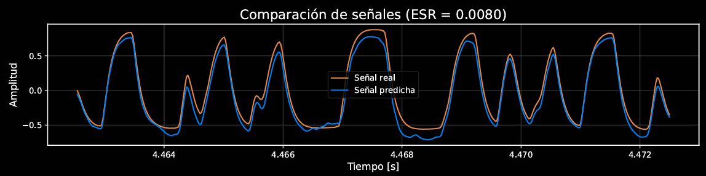

# AmpEmulatorModel [(🇪🇸)](README.md)

This academic project [1] contains the implementation of an artificial intelligence model in Python, developed with PyTorch and PyTorch Lightning, with an architecture based on WaveNet [2,3]. Its purpose is the accurate emulation of analog electric guitar equipment, such as tube amplifiers and effect pedals like *overdrive*, distortion, and compression. For use in a plugin context, it is recommended to use [AmpEmulatorPlugin](https://github.com/jajimesa/AmpEmulatorPlugin), although the export format (`.json`) is compatible with other community-developed plugins [5,6].

> The system is designed to model devices that do not introduce temporal dependencies in the signal [3], meaning their behavior can be considered instantaneous relative to the temporal context of the input signal. With a good dataset and a careful choice of the device to model, errors as low as 0.74% can be achieved, though typically the range is between 1-5% Error-to-Signal-Ratio (ESR) [1].

## Credits

Originally developed as part of my [Bachelor's Thesis](https://zenodo.org/records/15490785) for the Computer Engineering degree at the University of La Rioja (Spain), titled *Deep Learning for Real-Time Emulation of Electric Guitar Equipment with Raspberry Pi 5* [1]. Conceptually based on the repository [PedalNetRT](https://github.com/GuitarML/PedalNetRT) by Keith Bloemer [4]. I am very grateful for his contributions to the community, which not only helped me learn a lot but also allowed me to test my project using his plugins [4].

## Repository Structure

### `model/` Folder
Contains the main scripts for training, evaluating, and exporting emulation models.

> The `model/data` folder stores the `dataset` you wish to use, while `model/results` holds the files generated from training, exporting, and inferring with the model. Finally, `model/tests` stores the obtained test results.

#### Executable Scripts

- `train.py`: Trains a new model or resumes training an existing one.
- `predict.py`: Generates a prediction from clean training data using a trained model.
- `test.py`: Performs inferences and generates plots to evaluate the model's performance.
- `export.py`: Converts a trained `.ckpt` model into a `.json` file, compatible with WaveNetVA or real-time implementations.

#### Auxiliary Scripts

- `model.py`: Defines the WaveNet architecture in PyTorch Lightning and its components (forward, loss, optimizer, etc.).
- `data.py`: Implements the loading and preparation of training and validation data. Not executed directly.

### `profiles/` Folder

Contains emulated profiles, each in its own folder. They include the original training data (clean guitar, `input.wav`, and guitar with the target sound to replicate, `output.wav`), the generated predictions, and the test results associated with the trained model.

## Installation

1. Clone the repository, for example, from the terminal:
   ```bash
   git clone https://github.com/jajimesa/AmpEmulatorModel.git
   ```

2. Install the dependencies (it is recommended to create a virtual environment):
   ```bash
   pip install -r requirements.txt
   ```

## Usage Guide
Creating a new profile with the model involves three steps: preparing the `dataset` > training the model > testing the model.

#### Preparing the `dataset`
The model only requires approximately 3 minutes of audio to achieve high-fidelity results. The dataset consists of two files, `input.wav` and `output.wav`, both of the same duration. The first is a clean recording of your guitar, and the second is the same recording processed through the amplifier or pedal you want to emulate.

- Record approximately 3 minutes of audio in `.wav` format of your electric guitar through a clean channel, using as many techniques as possible and exploring the full tonal range of the guitar. For best results, use a single pickup and avoid adjusting the volume or tone knobs. Name this file `input.wav` and save it in `model/data`. If you don’t want to record your own dataset from scratch, you can use the default `input.wav` file located in `model/data`.

- Process the `input.wav` file through the amplifier or pedal you wish to emulate, and save it in `.wav` format as output.wav. If modeling a real device, it is recommended to connect the output of your computer’s audio interface to the amplifier or pedal, and capture its output through the interface’s input. Then, play the `input.wav` file and record the result.


> The `.wav` files used in the dataset must meet the following specifications:   
> - **Format**: WAV.   
> - **Sample Rate**: 44.1 kHz.   
> - **Bit Depth**: 32-bit FP (floating point).   
> - **Channels**: Mono.   
> - **Duration**: Approximately 3 minutes.
>   
> Ensure that your `.wav` files meet these specifications to guarantee compatibility with the emulation model. The image shows how to achieve this configuration using the DAW [Reaper](https://www.reaper.fm/).

#### Training the `model.ckpt`
Run the `model/train.py` script:
```bash
python model/train.py
```

#### Testing the Model
Invoke the testing utilities using the`model/test.py` script, with its output stored in `model/tests`:
```bash
python model/test.py
```

If you want to hear the inference result by processing the entire `data/input.wav` file, you can use model/predict.py and compare it yourself with the target sound in `data/output.wav`. The resulting file is stored in `model/results`.




> Comparison between the real and predicted signals, with two different plots, for Fuzz Face and Klon Centaur pedals, respectively. Errors as low as 0.74% and 0.80% are achieved.

#### Exporting as `model.json`
You can export the resulting model to `.json` format, which can be used in [AmpEmulatorPlugin](https://github.com/jajimesa/AmpEmulatorPlugin), [WaveNetVA](https://github.com/damskaggep/WaveNetVA) or [PedalNetRT](https://github.com/GuitarML/PedalNetRT) for real-time applications.

## References
[1] Jiménez Santana, J.: "Aprendizaje profundo para la emulación en tiempo real de equipamiento de guitarra eléctrica con Raspberry Pi 5". *Zenodo* (2025). [DOI](https://doi.org/10.5281/zenodo.15490785)   
[2]	Wright, A. et al.: "Real-Time Guitar Amplifier Emulation with Deep Learning". *Applied Sciences* (2020). [DOI](https://doi.org/10.3390/app10030766)   
[3]	Van den Oord, A. et al.: "WaveNet: A Generative Model for Raw Audio". *arXiv* (2016). [DOI](https://doi.org/10.48550/arXiv.1609.03499)   
[4]	Bloemer, K.: PedalNetRT, [GitHub](https://github.com/GuitarML/PedalNetRT). (2020).   
[5]	Damskägg, E.-P.: WaveNetVA, [GitHub](https://github.com/damskaggep/WaveNetVA). (2019).   
[6]	Bloemer, K.: SmartPluginAmp, [GitHub](https://github.com/GuitarML/SmartGuitarAmp). (2020).

Author: *Javier Jiménez Santana*    
Supervisors: *Jose Divasón Mallagaray, Silvano Nájera Canal*


