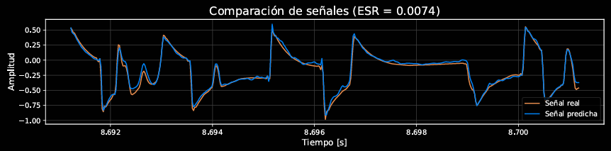

# AmpEmulatorModel (🇪🇸)

Este proyecto académico, [1], contiene la implementación de un modelo de inteligencia artificial en Python, desarrollado con PyTorch y PyTorch Lightning, cuya arquitectura está basada en WaveNet [2,3]. Su propósito es la emulación precisa de equipos analógicos de guitarra eléctrica, tales como amplificadores a válvulas y pedales de efectos como *overdrive*, distorsión y compresión. Para su uso en un contexto de plugin, se recomienda usar [AmpEmulatorPlugin](https://github.com/jajimesa/AmpEmulatorPlugin), aunque el formato de exportación (`.json`) es compatible con otros plugins desarrollados por la comunidad [5,6].
> El sistema está diseñado para modelar dispositivos que no introduzcan dependencias temporales en la señal [3], es decir, que su comportamiento pueda considerarse instantáneo respecto al contexto temporal de la señal de entrada. Con un buen dataset y una buena elección del dispositivo a modelar, se puede llegar a obtener errores de tan solo el 0.74%, aunque normalmente el intervalo va del 1-5% de Error-to-Signal-Ratio (ESR) [1].

#### Créditos
Desarrollado originalmente como parte de mi [Trabajo Fin de Grado](https://zenodo.org/records/15490785) para la titulación de Ingeniería Informática de la Universidad de La Rioja (España), titulado *Aprendizaje profundo para la emulación en tiempo real de equipamiento de guitarra eléctrica con Raspberry Pi 5* [1]. Basado conceptualmente en el repositorio [PedalNetRT](https://github.com/GuitarML/PedalNetRT), de Keith Bloemer [4]. Agradezco mucho sus contribuciones a la comunidad, gracias a las cuales no solo he aprendido mucho, sino que he podido testear mi proyecto empleando sus plugins [4].

## Estructura del repositorio

### Carpeta `model/`
Contiene los scripts principales para entrenar, evaluar y exportar modelos de emulación. 
> En la carpeta `model/data` se almacena el `dataset` que queramos utilizar, mientras que en `model/results`, se guardan los ficheros resultantes de entrenar, exportar e inferir con el modelo. Por último, en `model/tests` se guardan los tests obtenidos.

#### Scripts ejecutables

- `train.py`: entrena un nuevo modelo o retoma el entrenamiento de uno existente.

- `predict.py`: genera una predicción a partir de los datos de entrenamiento limpios usando un modelo entrenado.

- `test.py`: realiza inferencias y genera gráficas para evaluar el rendimiento del modelo.

- `export.py`: convierte un modelo `.ckpt` entrenado en un archivo `.json`, compatible con WaveNetVA o implementaciones en tiempo real.

#### Scripts auxiliares

- `model.py`: define la arquitectura WaveNet en PyTorch Lightning y sus componentes (forward, loss, optimizador...).

- `data.py`: implementa la carga y preparación de los datos de entrenamiento y validación. No se ejecuta directamente.

### Carpeta `profiles/`

Contiene perfiles emulados, cada uno en su propia carpeta. Incluyen los datos originales de entrenamiento (guitarra en limpio, `input.wav` y guitarra con el sonido objetivo a replicar `output.wav`), las predicciones generadas y los resultados de los tests asociados al modelo entrenado.

## Instalación
1. Clona el repositorio, por ejemplo, desde la terminal:
   ```bash
   git clone https://github.com/jajimesa/AmpEmulatorModel.git
   ```
2. Instala las dependencias (se recomienda crear un entorno virtual):
   ```bash
	 pip install -r requirements.txt
   ```

## Guía de uso
Crear un nuevo perfil con el modelo consta de tres pasos: crear el `dataset` > entrenar el modelo > testear el modelo.

#### Preparación del `dataset`  
El modelo solo requiere aproximadamente de 3 minutos de audio para lograr resultados de alta fidelidad. El dataset consta de dos ficheros, `input.wav` y `output.wav`, ambos con la misma duración. El primero es una grabación en limpio de nuestra guitarra, y el segundo es la misma grabación del primero, pero procesada a través del amplificador o pedal que queremos simular.
- Graba aproximadamente 3 minutos de audio en formato `.wav` de tu guitarra eléctrica en un canal limpio, empleando el mayor número de técnicas posible y explorando todo el registro tonal de la guitarra. Para mejores resultados, emplea una sola 	pastilla de la guitarra y no toques los potenciómetros de volumen ni tono. Llama a este fichero `input.wav` y guárdalo en `model/data`. Si no quieres grabar tu propio dataset desde cero, puedes emplear el fichero llamado `input.wav` que se encuentra por defecto en `model/data`.
- Procesa el fichero `input.wav` mediante el amplificador o pedal que quieras emular, y guárdalo en formato `.wav` con el nombre `output.wav`. Si quieres modelar un dispositivo real, se recomienda conectar la salida de la interfaz de audio del ordenador al amplificador o pedal, y recoger su salida a través de la entrada de la interfaz. Entonces, reproducir el fichero `input.wav` y grabar el resultado.


> Los archivos `.wav` utilizados en el dataset deben cumplir con las siguientes especificaciones:
> - **Formato**: WAV.
> - **Frecuencia de muestreo**: 44.1 kHz.
> - **Profundidad de bits**: 32-bit FP (punto flotante).
> - **Canales**: Mono.
> - **Duración**: Aproximadamente 3 minutos.
>   
> Asegúrate de que los archivos `.wav` cumplan con estas especificaciones para garantizar la compatibilidad con el modelo de emulación. La imagen muestra cómo lograr esta configuración empleando el DAW [Reaper](https://www.reaper.fm/).

#### Entrenamiento del `model.ckpt`
Ejecutamos el script `model/train.py`
```bash
python model/train.py
```
#### Testeo del modelo
Invocamos a las utilidades de testing mediante el script `model/test.py`, cuyo output se almacena en `model/tests`:
```bash
python model/test.py
```
Si queremos escuchar el resultado de la inferencia procesando el fichero `data/input.wav` al completo, podemos usar `model/predict.py` y comparar nosotros mismos con el sonido objetivo de `data/output.wav`. El archivo resultante se almacena en `model/results`.


	

> Comparación entre la señal real y la predicha, con dos gráficos diferentes, para unos pedales *fuzz face* y *klon centaur*, respectivamente. Se logran erroes minúsculos, del 0,74% y 0.80%.

#### Exportación como `model.json`
Podemos exportar el modelo resultante a formato `.json`, para poder ser utilizado en [AmpEmulatorPlugin](https://github.com/jajimesa/AmpEmulatorPlugin), [WaveNetVA](https://github.com/damskaggep/WaveNetVA) o [PedalNetRT](https://github.com/GuitarML/PedalNetRT) en tiempo real.

## Referencias
[1] 	Jiménez Santana, J.: "Aprendizaje profundo para la emulación en tiempo real de equipamiento de guitarra eléctrica con Raspberry Pi 5". *Zenodo* (2025). [DOI](https://doi.org/10.5281/zenodo.15490785)   
[2]	Wright, A. et al.: "Real-Time Guitar Amplifier Emulation with Deep Learning". *Applied Sciences* (2020). [DOI](https://doi.org/10.3390/app10030766)   
[3]	Van den Oord, A. et al.: "WaveNet: A Generative Model for Raw Audio". *arXiv* (2016). [DOI](https://doi.org/10.48550/arXiv.1609.03499)   
[4]	Bloemer, K.: PedalNetRT, [GitHub](https://github.com/GuitarML/PedalNetRT). (2020).   
[5]	Damskägg, E.-P.: WaveNetVA, [GitHub](https://github.com/damskaggep/WaveNetVA). (2019).   
[6]	Bloemer, K.: SmartPluginAmp, [GitHub](https://github.com/GuitarML/SmartGuitarAmp). (2020).

Autor: *Javier Jiménez Santana*   
Tutores: *Jose Divasón Mallagaray, Silvano Nájera Canal*
